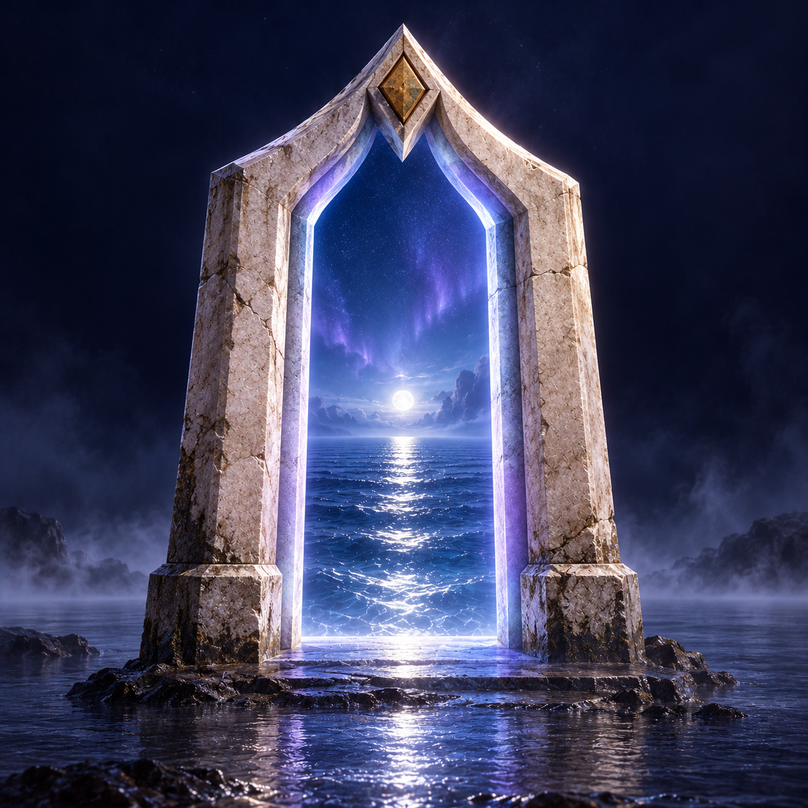
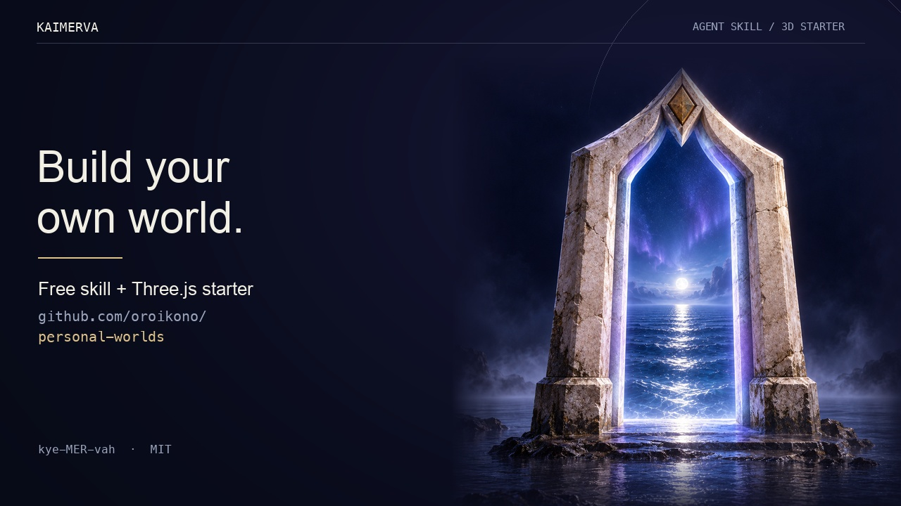

#  Kaimerva <sub>kye-MER-vah</sub>

**Summon your world.**

A free agent skill and Three.js starter for making your portfolio a place people can explore. Bring your research, projects, notes or personal story. Give them a setting that feels like you, with useful interactions and work that stays easy to read.

Built by [Orestis Oikonomou](https://orestis-site.vercel.app), with AI assistance, while exploring what his own research and creative portfolio could become.

**[Try the demo](https://huggingface.co/spaces/oroikono/kaimerva)** · **[Read the skill](skills/kaimerva/SKILL.md)** · **[Use the starter](https://github.com/oroikono/Kaimerva/generate)**

**Spelled:** K-A-I-M-E-R-V-A · **Codex skill:** `$kaimerva`

It started as an Aegean portfolio: a boat, islands and instruments for exploring the work. The name combines [kami](https://d-museum.kokugakuin.ac.jp/eos/detail/?id=9958), Shinto spirits and deities, with [Minerva](https://www.metmuseum.org/art/collection/search/206339), associated with wisdom and the arts. [Naming and artwork credits](docs/branding.md).

[](docs/assets/kaimerva-launch.mp4)

**[Watch the 24-second launch film](docs/assets/kaimerva-launch.mp4)**

The film combines earlier real starter footage with new Kaimerva branding, motion graphics and original sound. It shows exploration, three settings and a local content refresh. The current demo also includes a figure passage, and the source includes a typed world-settings editor. Neither is shown in the film. No agent execution is staged. [Video sources and limits](docs/launch-video.md).

## Two ways to use it

**Use the skill in your own app.** It guides your agent through the brief, art direction, implementation and review. Keep your stack, routes, content source and branding. For compatible Three.js apps, the copied skill now also carries three working inspection instruments. A coast, mountain observatory, orbital station, city or forest can each have its own objects and interactions; mountain and city mechanisms are proposals rather than included modules.

**Create a standalone world from the skill.** The copied folder now includes the working starter and a scaffold command. It ships a coast, an orbital field and a woodland trail, with readable collections, keyboard exploration, Pause, local updates and figure inspection. The generated project uses one locked runtime dependency and builds a static site for deployment.

The skill carries guidance, an optional instrument component and the complete starter source. It needs no original checkout to create a project. New settings and interactions still need implementation; changing a theme name does not generate a new world.

## Give your agent a brief

After installing the skill, start with something like this:

```text
Use $kaimerva to create my portfolio in a new directory.

I’m a researcher who also makes films and writes field notes.
Build a Mediterranean harbor with a few orbital instruments:
pale stone, brushed metal, warm glass and a calm sea.

Let people explore, inspect my supplied figures through a lens,
and open each project’s readable page immediately.
Start from the bundled sea world. Keep my supplied facts accurate,
mobile reading, keyboard access and Pause. Use no paid services.
Customize the source, check and build it, and show the rendered result.
```

Make the brief yours: who you are, what visitors should find, how it should feel, one interesting action and what must be preserved. For an existing app, say so and name its CMS and routes; the skill adapts it instead of creating a replacement. One rich prompt starts the workflow; the agent still builds, checks and revises the result.

## Install the skill

From this repository's root, copy the **whole folder** into your target project. Replace `../my-portfolio` with its path:

```sh
mkdir -p ../my-portfolio/.agents/skills
cp -R skills/kaimerva ../my-portfolio/.agents/skills/
```

Open Codex in the target project and invoke **`$kaimerva`**. The skill itself needs no npm install. If you already have a copy there, review it before replacing it.

For Claude Code, use `.claude/skills` in the destination and invoke `/kaimerva`:

```sh
mkdir -p ../my-portfolio/.claude/skills
cp -R skills/kaimerva ../my-portfolio/.claude/skills/
```

Actual Codex discovery of the original guidance package passed with CLI 0.160.0 on 8 October 2026. That is historical discovery evidence; it does not demonstrate agent execution of this expanded starter package. Claude Code runtime loading remains untested. [Install evidence](docs/research/skill-install-test-2026-10-08.md) · [Component checks](docs/interaction-refinement-2026-10-08.md#verification-status) · [Independent creation trial](docs/research/skill-forward-test-2026-10-07.md).

## Create from the copied skill

With Node.js 22 or newer, run the helper from your installed folder. For example,
from the target project containing `.agents/skills/kaimerva`:

```sh
node .agents/skills/kaimerva/scripts/create-world.mjs ../my-world --theme sea
cd ../my-world
npm ci
npm run check
npm run dev
```

Choose `sea`, `orbital` or `woodland`. The destination must be new or empty;
the helper verifies its 39-file source payload before copying and refuses an
existing nonempty project. It makes no network calls or deployment. The agent
then personalizes the project from your brief. The same helper works from an
extracted skill folder, without installing it in an agent host.

The generated project includes a lockfile, standalone check, build and preview
tools, local settings editor, asset notices and a Vercel configuration selecting
`dist/`. Build with `npm run build`, then deploy the contents of that directory.
[Creation and deployment guide](docs/deployable-skill.md) ·
[Skill workflow](skills/kaimerva/references/create-and-deploy.md).

Clean copied-skill creation, build and local HTTP serving passed for all three
settings. A separate fresh `npm ci` and build also passed. The full repository
suite now passes 103 tests; these establish portability and a buildable result,
not new agent execution or rendered visual quality.
[Package validation evidence](docs/skill-package-validation-2026-10-08.md).

## Run the starter

Requires **Node.js 22 or newer**. From this repository's root:

```sh
npm ci
npm run dev
```

Open **http://127.0.0.1:4310**. Click a landmark to open its work, or browse the ordinary index. Reading opens immediately; you do not have to wait for the traveler.

Choose **Enter the world** to play in a full-viewport scene. Hold Right/D or Left/A to travel the authored route. Near a light, **E / Space** or **Chart this place** charts that beacon and opens its work. The lights brighten nearby, remain gold after discovery and connect when all five places are charted. **Return to world** keeps that session; Escape or **Leave world** returns to the portfolio.

The sea uses the low boat-follow camera and wake; space and woodland use their overview with the same held movement and charting. On-screen direction buttons support held touch input. Paused/reduced motion uses one destination per press. Enter or **Read the selected work** opens reading anywhere, without granting discovery. The readable index remains available without playing. This is route-based exploration, not free boat physics or a full game engine.

Outside play, **Atlas view** restores all five labeled landmarks, with arrows visiting one neighboring island at a time. Paused/reduced motion also uses one destination per press. **Reveal the field** shows an illustrative wave-interference study; dragging the water or changing **Wave spacing** adjusts its source separation. The water uses scene reflections and locally generated environment lighting. It is an authored visual scene, not a fluid simulation.

Inside play, **Map view** shows the route while held controls still move the
traveler. Outside play, Atlas arrows visit individual stops. Field controls are
available outside the play session. [Play-loop implementation and evidence](docs/play-session-2026-10-08.md).

| Orbital field | Woodland trail |
| --- | --- |
|  |  |

## The same work, a different instrument

The Aegean idea is a way to reach and inspect the work. Choose a project or study in **Choose a work to inspect**, then click **Inspect in 3D**, or open an inspectable landmark. Its explanation is available immediately while its instrument opens. Change the setting inside the reader: the selected entry and supplied view stay with you.

| Setting | Working instrument | Motion |
| --- | --- | --- |
| Sea | Stone-and-brass optical housing | Six iris leaves hinge open around the supplied image |
| Space | Angular scanning gantry | Shutter banks fold and retract; the scan carriage moves between views |
| Nature | Timber specimen cabinet | Glass doors swing open and drawers extend with view selection |

Visitors can switch between up to three supplied images with buttons or left/right arrows, read their explanations, or open the selected view full-size. **Return to world** reverses the passage and restores focus. Returning in the same setting restores the saved exploration pose; after changing settings, it returns to that setting's atlas. The ordinary index keeps every entry accessible, including work with no image.

The starter project includes three original explanatory views of Kaimerva itself. They demonstrate project inspection without treating the project as a paper. [Project views](docs/project-views.md) · [Interaction map](docs/interaction-map.md) · [Portable component and integration contract](skills/kaimerva/references/interaction-translation.md#optional-working-instrument-module).

The included wave plates are illustrative artwork, not paper results. Replace them with an authorized figure and accurate descriptions. The scene displays what you supply; it does not invent scientific results or generate an apparatus for every new paper. [Figure format](docs/content.md#figures-and-the-inspection-passage).

**Pause** freezes ambient motion and the camera while keeping reading usable. Reduced motion uses static states or deliberate navigation. On phones, the figure sits above its reader. If WebGL is unavailable, the HTML reader and supplied image remain accessible.

This refinement is local. Deterministic geometry, image-lifecycle and reader-controller checks are separate from rendered review. The public demo and launch film still show the earlier version; the film misses this inspection sequence. [Revision evidence](docs/interaction-refinement-2026-10-08.md).

## From the icon to the world

The local coast now has an open, weathered stone gateway: segmented masonry, an inset gold diamond, recessed cool light and wet foundations. **Approach the portal** selects Journey and gives the structure a lower, fixed-bearing view; **Atlas view** returns to the full route. A moonlit sky supplies the same light direction as the water highlight, with bounded planar reflections and distant headlands.

Space uses a star/nebula environment and worn ceramic surfaces. Woodland uses a moonlit canopy, textured timber and moss, and continuous rolling terrain beneath the clearings. Their authored objects stay distinct. Supplied images bypass scene fog and tone mapping so the work retains its colors.

These are native procedural objects and materials, with no downloaded game models or paid texture packs. They bring the approved icon's material and lighting direction into the scene; they do not establish photorealism or Unreal-level rendering. This graphics revision is local and its fresh browser appearance remains unreviewed. [Art direction](docs/realm-art-direction.md) · [Revision and checks](docs/realm-refinement-2026-10-08.md).

## Keep it easy to change

| What you want to change | Where to start |
| --- | --- |
| Identity, projects, papers, notes, journey and news | [`data/site.json`](data/site.json) |
| Supported theme, lighting, reader and button settings | [`data/world.json`](data/world.json) |
| Gateway silhouette, masonry, foundations and inset light | [`src/realm-portal.js`](src/realm-portal.js) |
| Theme sky, fog, environment and directional lighting | [`src/realm-atmosphere.js`](src/realm-atmosphere.js) |
| Original ceramic, timber, moss and stone surface studies | [`src/realm-surfaces.js`](src/realm-surfaces.js) |
| Objects and authored layouts | [`src/world.js`](src/world.js) |
| Inspection housings and their movement | [`src/figure-passage.js`](src/figure-passage.js) |
| Typography, spacing and reading layout | [`src/styles.css`](src/styles.css) |
| Asset sources and reuse records | [`data/assets.json`](data/assets.json) |

For **local content edits**, save `data/site.json` and press **Refresh content**. Only entries with `published: true` appear. The preview validates incoming content and keeps the last valid snapshot for the current page session if a refresh fails. Adding or replacing figure image files requires restarting the preview.

For **supported world settings**, ask your agent for a change or edit `data/world.json`, then press **Refresh world settings**. A small configuration editor also supports reviewed patches and undo:

```sh
node scripts/world-edit.mjs show
node scripts/world-edit.mjs apply my-patch.json
node scripts/world-edit.mjs undo
```

The editor handles existing themes, lighting, inline/dialog readers, solid/glass panels and square/pill buttons. New geometry, layouts and game rules need code. It uses your coding agent; there is no embedded browser AI chat. [Prompt editing guide](skills/kaimerva/references/prompt-world-editing.md).

The production build is a **static snapshot**. Updating a deployed site without rebuilding requires replacing public JSON or adding a runtime content provider. No hosted CMS or live Notion adapter is configured. For a production portfolio, also add rendered entry pages, canonical URLs, identity metadata and a sitemap in your chosen stack. [Content and CMS notes](docs/content.md) · [Hosting](docs/hosting.md).

## Check and build

```sh
npm test         # Content, build and HTTP publication checks
npm run check    # Bounded source, provenance and skill checks
npm run build    # Static site in dist/
npm run preview  # Preview the built snapshot
npm run skill:check # Check the bundled starter matches its source
```

`dist/` is replaced on each build. Keep your source content and assets outside it. When maintaining the repository, run `npm run skill:pack` after starter-source changes and review the updated bundle. `npm run check` rejects stale packaged source. [What was actually verified](docs/verification.md).

## Where this fits

Kaimerva connects **identity → content → objects → materials → motion → interaction**. The aim is a setting that expresses the person and helps visitors understand their work.

Playable portfolios, 3D design skills and prompt-driven website tools already exist. Kaimerva brings personal storytelling, optional exploration, readable content and an editing workflow together; we do not claim to have invented those ideas. [Related work](docs/prior-art.md) · [Current comparison](docs/research/uniqueness-recheck-2026-10-08.md) · [Provenance audit](docs/provenance-audit.md).

If you build a different world, show us. Original settings, tested content adapters and clearer first-use flows are useful contributions. Include what you tested on desktop and phone, how people reach the content without WebGL, and the reuse basis for any added assets.

## License and credits

The project's code, procedural demo artwork and included AI-generated portal icon are distributed under [MIT](LICENSE). [The artwork record](docs/branding.md#artwork-attribution) identifies the icon's art direction and generation process. Three.js keeps its own [MIT notice](https://github.com/mrdoob/three.js/blob/r186/LICENSE), included in every build.

Make the identity, branding and footer your own. Keep the required license notices when redistributing covered material; a permanent visible author credit is not required. Any third-party media you add needs its own reuse basis. The starter includes no private CMS records, source-site portraits or third-party paper figures.
