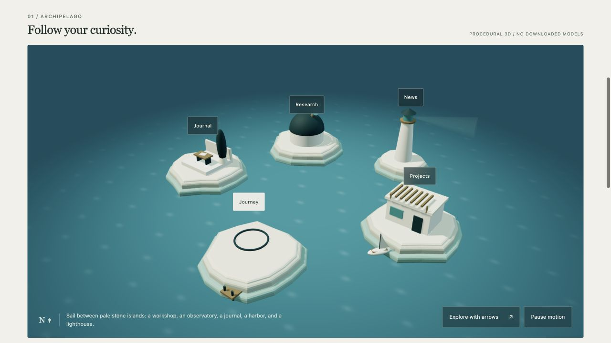
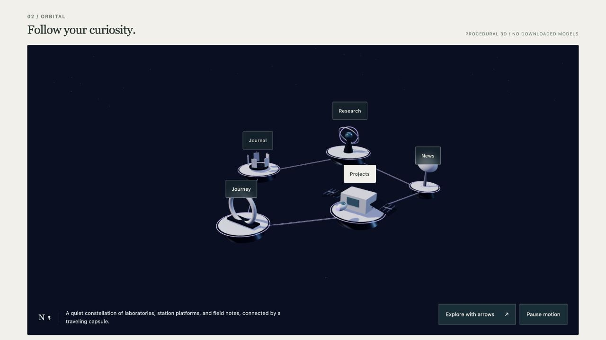
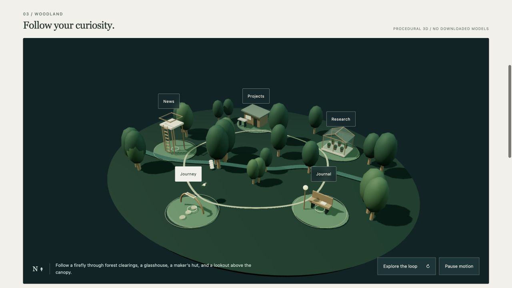

# Personal Worlds

**A free agent skill and starter for turning a personal story into an interactive portfolio world.**

Built by [Orestis Oikonomou](https://orestis-site.vercel.app), with AI assistance, from the practical work of making a research, projects, and personal-life portfolio feel like a place.

**[Try the live demo](https://oroikono.github.io/personal-worlds/)** · **[Use this template](https://github.com/oroikono/personal-worlds/generate)** · **[Read the skill](skills/build-personal-world/SKILL.md)**



Your setting could be a coast, a station in orbit, a forest, a desert observatory, or something else entirely. Its objects, materials, motion, and navigation should express your story. The readable work and updates remain separate from the scenery.

This repository contains two useful pieces:

- **[The portable skill](skills/build-personal-world/SKILL.md)** helps an agent study references, derive a personal metaphor, build coherent interactions, preserve readable content, and track asset rights. Use it in an existing app; no particular framework or theme is mandatory.
- **A working procedural Three.js starter** demonstrates three different settings, immediate content selection, optional arrow-key destination navigation, motion controls, local JSON updates, and a graphics fallback. One runtime dependency. No downloaded models, images, fonts, accounts, or paid service required.

| Orbital field | Woodland trail |
| --- | --- |
|  |  |

## Try the starter

Requires Node.js 22 or newer.

```sh
npm ci
npm run dev
```

Open **http://127.0.0.1:4310**. Switch between the coast, orbital field, and woodland trail. Click a landmark or the background to explore, or use the readable index. **Explore the loop** also focuses the world: Right/Down move clockwise to the adjacent stop, Left/Up go counterclockwise, Enter opens the selected entry, and Escape returns to the page. The last stop connects back to the first. The traveler follows the visible curved route; pointer visits take its shortest arc. Holding an arrow repeats at a bounded pace; keyboard Enter/Space on a landmark opens its entry directly. This starter uses destination navigation; it does not include free steering or a collision simulation.

The **Aegean observatory** adds a dusk sea, sculpted coastlines, a sailor aboard a responsive boat, and a luminous wake. Click the central lens or **Reveal the field** to inspect an illustrative wave-interference field. Drag horizontally across the water or use **Wave spacing** to change the separation between its sources. **Voyage view** follows the traveler with a closer camera; **Atlas view** restores the full circular map. While the world has focus, **F** toggles the field and **V** switches the view. Pause freezes motion while keeping field and content controls usable. The field is an authored analytic visual study, not a paper result, a fluid solver, or a validated research experiment.

```sh
npm test         # Content validation and real build/server publication checks
npm run check    # Bounded source/provenance/skill checks
npm run build    # Static output in dist/ with dependency notices
npm run preview  # Preview the built snapshot
```

The three settings change geometry, layout, materials, lighting, and ambient movement. They share the same destination controls. The skill can design a different interaction grammar for another person's theme.

`dist/` is generated output and is replaced on each build. Keep source content and added assets outside it.

| Edit | Location |
| --- | --- |
| Identity, projects, papers, notes, chapters, updates | `data/site.json` |
| World names and descriptions | `src/themes.js` |
| Procedural objects and authored layouts | `src/world.js` |
| Type, spacing, colors and responsive reading layout | `src/styles.css` |
| Reused asset evidence | `data/assets.json` |

## Use the skill

The canonical folder is `skills/build-personal-world/`. Copy that whole folder to the skill directory supported by your agent; its references travel with it. The standard `SKILL.md` is the portable part; `agents/openai.yaml` supplies optional Codex UI metadata.

For a project in Codex:

```sh
mkdir -p .agents/skills
cp -R skills/build-personal-world .agents/skills/
```

For a project in Claude Code:

```sh
mkdir -p .claude/skills
cp -R skills/build-personal-world .claude/skills/
```

Then ask your agent, for example:

```text
Use build-personal-world to make an architect's quiet desert-observatory
portfolio in Astro, with project case studies, photo essays and news.
Use conventional navigation, no game controls, and no paid service.
```

In Codex, explicitly invoke `$build-personal-world`; in Claude Code use `/build-personal-world` or name the skill in the request. See the current [Codex instructions](https://developers.openai.com/codex/skills/), [Claude Code instructions](https://code.claude.com/docs/en/skills), and [Agent Skills format](https://agentskills.io/specification) for discovery/install behavior. Format checks and an independent forward-test passed; a real Claude Code loading test has not been run. [Verification details](docs/verification.md).

## Keep content easy to update

In the local preview, edit `data/site.json` and press **Refresh content**. The server validates the file on each request, so content edits need no rebuild. A successful empty collection stays empty; only an explicit `published: true` entry is displayed. The demo tells you when it is showing example content or a prior validated snapshot after a failed refresh.

The production build is a **static snapshot**, not a hosted CMS. To update a deployed site without rebuilding it, replace its public content JSON or implement a runtime endpoint/provider. The skill includes a provider-neutral workflow; no live CMS account or Notion adapter is configured. [Content and CMS notes](docs/content.md).

The public demo is hosted free on GitHub Pages from the separate `codex/demo` branch. Paths are relative so the build also works under a project subdirectory. [Hosting notes](docs/hosting.md).

The demo's content is rendered in the browser. For a production personal/research website, add server/build-rendered entry pages, real identity metadata, canonical URLs, feeds and a sitemap in your chosen stack. The existing collection anchors are not a complete SEO or routing system.

## What makes this useful

The method connects **identity → content → objects → materials → motion → interaction**. It distinguishes a deliberate theme from a recolored template, reading selection from travel, local edits from public updates, and an asset credit from reuse permission.

Other people have built excellent playable portfolios, creative 3D skills, and AI-customizable starters. This is not the first of those. Our focus is the practical combination of personal storytelling, optional exploration, maintainable content, and provenance. [Related work and boundaries](docs/prior-art.md).

An independent bounded review distinguishes copied dependencies, conceptual references and project-authored work. [Provenance audit](docs/provenance-audit.md). It documents evidence and limitations, not legal clearance.

## Extend it

Contributions that make this easier to use are welcome: new original settings, a server-rendered content adapter, or a real tested CMS provider. A useful new theme changes objects and spatial logic, demonstrates a desktop and phone composition, and keeps the same content reachable without WebGL. Include asset/license evidence and say which behavior you actually tested.

The illustrative identity, entries and geometry are released with the repository under **MIT**. Three.js retains its own [MIT notice](https://github.com/mrdoob/three.js/blob/r186/LICENSE), copied into every build. No source-site portraits, paper figures, private CMS records, reference screenshots, or chat/session archives are included. Added third-party media needs its own reuse basis; this project's license does not grant it.

Make the identity, branding, and visible footer your own. Retain the required license notices when redistributing code; a permanent visible author credit is not required by MIT.
