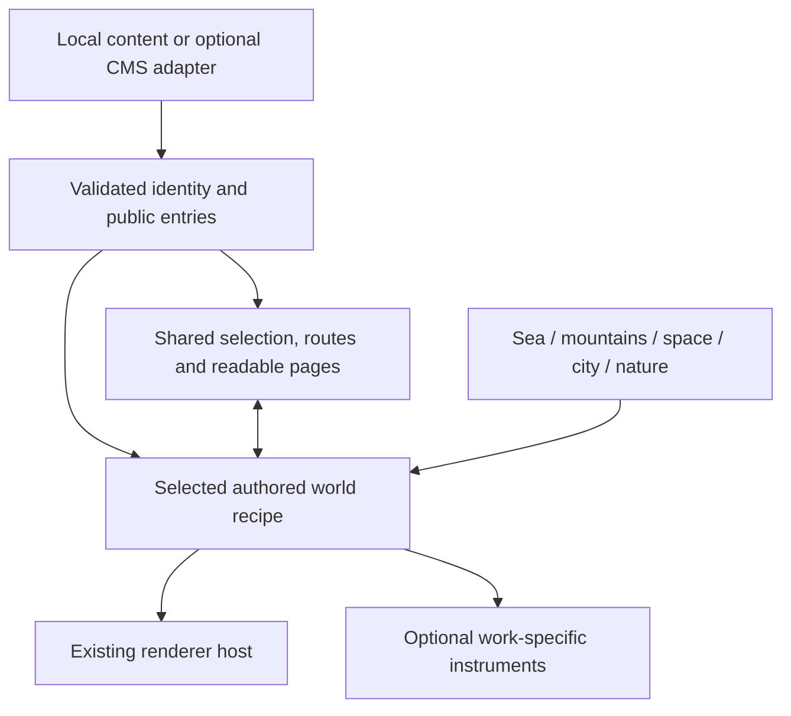

# Personal Worlds: repository patterns and a modular skill proposal

Reviewed **7 October 2026, Europe/Zurich**. Three delegated passes covered agent-skill packaging, creative portfolio repositories and the current architecture; a supplementary pass inspected creative tooling and distribution. The presentation comparison contains **19 repositories**, including one archived predecessor, two architectural libraries, a distribution CLI and a directory. It is a purposeful sample, not every repository on GitHub. This report is the requested research-before-implementation stage.

## Recommendation

Develop **one portable portfolio skill, one shared content/reading core, and optional authored world recipes**. Sea, mountains, space, city and nature are good families. Each should give a person's work a different spatial form and useful interaction while preserving its identity, pages and update path.

Related work is real: [ORBIT](https://github.com/HenrikBrehm/orbit), [Memory Palace](https://github.com/bingran-you/bingran-you/tree/main/repo-skills/memory-palace) and [3Dviz Pro Max](https://github.com/viettranx/3dviz-pro-max) already cover portfolio customization/deployment or creative 3D agent workflows. A modular scene system also has precedents. Our proposed position is **“Turn your work into a world you can keep updating.”** Earn it through a repeatable adaptation and content-edit demonstration. It is not an established first invention or a current guarantee of generation quality.

The existing `build-personal-world` skill is a useful base. It is already packaged in this repository. The five-family modular system described here has not been built.

## What was compared

Counts are dated public GitHub API snapshots; stars are attention, not active users or a causal explanation of success. Parent collection metrics are explicitly separated from individual skills. Most source inspection occurred around **11:57–11:58 Zurich**, with later supplemental reads recorded in their ledger.

| Repository | Stars | Role | Most useful organizational distinction |
| --- | ---: | --- | --- |
| [Superpowers](https://github.com/obra/superpowers) | 296,161 | General skill framework | Composable development phases and behavior evaluation guidance |
| [Anthropic Skills](https://github.com/anthropics/skills) | 179,983 | Whole collection | Self-contained skill folders; frontend-design is compact guidance |
| [UI UX Pro Max](https://github.com/nextlevelbuilder/ui-ux-pro-max-skill) | 133,704 | Design system/skill/tooling | Canonical catalogs and saved design rules with overrides |
| [Impeccable](https://github.com/pbakaus/impeccable) | 78,001 | Design commands/tooling | Focused actions; durable product context separate from visual direction |
| [GSD former home](https://github.com/gsd-build/get-shit-done) | 64,361 | Archived predecessor | Redirect to current home; these stars do not belong to Core |
| [HyperFrames](https://github.com/heygen-com/hyperframes) | 58,180 | Agent-operated creative product | Workflows, domain skills, runtime packages and inspectable outputs |
| [VoltAgent skill directory](https://github.com/VoltAgent/awesome-agent-skills) | 35,300 | Curated distribution | Concise categories and evidence of community use before submission |
| [Skills CLI](https://github.com/vercel-labs/skills) | 33,311 | Distribution infrastructure | Standard discovery, scoped installation, update/removal paths |
| [Vercel Agent Skills](https://github.com/vercel-labs/agent-skills) | 32,020 | Whole collection | Small rule/source modules with examples and generated outputs |
| [React Three Fiber](https://github.com/pmndrs/react-three-fiber) | 32,770 | Architectural library | Composable rendering and a minimal demonstrative application |
| [GSD Core](https://github.com/open-gsd/gsd-core) | 10,257 | Active continuation | Staged workflow, durable decisions and first-project tutorials |
| [drei](https://github.com/pmndrs/drei) | 9,915 | Helper library | Small extensions with examples, variants and contribution guidance |
| [Bruno Folio 2019](https://github.com/brunosimon/folio-2019) | 4,750 | Playable portfolio | Memorable interaction and separated game systems; very short README |
| [Three.js Skills](https://github.com/CloudAI-X/threejs-skills) | 3,478 | Technical skill collection | Focused capability folders, separate from thematic recipes |
| [Bruno Folio 2025](https://github.com/brunosimon/folio-2025) | 1,911 | Playable portfolio | Explicit game loop and separation of content from art production |
| [Adrian's island](https://github.com/adrianhajdin/3D_portfolio) | 1,350 | Educational portfolio | Stage-based spatial exploration connected to ordinary pages |
| [3Dviz Pro Max](https://github.com/viettranx/3dviz-pro-max) | 679 | Close creative-3D skill | Runnable studies and separate compatibility/evidence records |
| [Memory Palace host](https://github.com/bingran-you/bingran-you) | 3 | Close portfolio deployment skill | Practical deployment playbook and layered reuse boundaries |
| [ORBIT](https://github.com/HenrikBrehm/orbit) | 1 | Close commercial portfolio/skill | Small typed customization surface and explicit commercial terms |

Memory Palace's count concerns its entire host workspace. React Three Fiber/drei/CLI/directory counts do not establish demand for portfolio skills. ORBIT's public stars do not measure paid customers. Author audience, age, tutorials and product history differ. Bruno 2019 is a useful counterexample: substantial attention with a setup-only README. There is no single README formula shared by all successful projects.

Full per-repository presentation sequences, actual file organization, distinctive mechanisms, transfer proposals and reuse limits are in the [popular-skill report](popular-skill-formats-2026-10-07.md), [creative-repository report](creative-repo-formats-2026-10-07.md) and [supplement](supplemental-repo-formats-2026-10-07.md). Their JSON ledgers preserve retrieval dates, API URLs and inspected source paths. Links generally follow mutable branches; tree fingerprints are retained where available. A later release should pin its own revision and upstream references used for implementation.

## Six clusters of useful practices

These are qualitative clusters formed by comparing presentation order, editable source boundaries, first-use instructions, extension structure and evidence. They are not statistical clusters or popularity scores, and no claim is made that every repository follows each pattern.

| Cluster | Primary examples | Proposed application | Observable success |
| --- | --- | --- | --- |
| **1. Result and purpose early** | Impeccable's before/after, 3Dviz's studies, R3F's small visual example | Actual world preview, one precise sentence, live demo and one preferred start path | A newcomer understands what they can make before reading architecture |
| **2. Fast first successful use** | Skills CLI, Vercel, Impeccable, GSD Core | Standard install + one brief + expected output + one content edit; advanced options lower down | An independent user reaches a working adapted local portfolio |
| **3. Small entry, focused modules** | Anthropic folders, Impeccable references, Vercel rules, Three.js capability skills | One entry skill routes to the selected recipe and relevant content/rendering references | A sea request does not load five manuals or require a universal framework |
| **4. Durable facts and editable boundaries** | Impeccable PRODUCT/DESIGN separation, UI UX rules/overrides, ORBIT config | Canonical identity/content records separate from world direction and generated geometry | Editing an entry updates its object and page without reshuffling unrelated objects |
| **5. Inspectable behavior and honest limits** | 3Dviz evidence, Superpowers evaluations, GSD verification, HyperFrames outputs | Real invocation, resulting files, actual captures, human revisions and maintenance proof | Starter tours, host discovery, task execution and visual review are reported separately |
| **6. Small extension contributions** | drei stories, Vercel rule templates, R3F packages | A recipe/instrument example with contract, preview, rights record and focused checks | A contributor adds a useful module without changing the reader or every world |

The [Impeccable homepage](https://impeccable.style/) was also rendered in the browser: its visible hero pairs a concrete outcome with a before/after sample and immediate install/explanation actions. Most other presentation findings are README/tree/source observations, rather than a live visual ranking or gameplay benchmark.

## Distinctive features to combine deliberately

| Decision | Mechanism | Personal Worlds interpretation | Cost or reason |
| --- | --- | --- | --- |
| **Adopt** | Standard self-contained skill packaging | Keep the existing canonical `build-personal-world` folder and standard discovery | No proprietary editor, custom installer or subscription needed for the starter |
| **Adapt** | Impeccable's action vocabulary | Support clear intents such as design, adapt, edit and verify through the same skill | These are proposed workflow intents, not newly implemented slash commands |
| **Adapt** | UI UX canonical rules and overrides | Shared content/accessibility invariants with recipe-owned visual and interaction choices | Preserve coherent art direction without forcing one style on every person |
| **Adapt** | Bruno's coherent experience | Give each world one meaningful primary mechanic tied to its owner's work | A full vehicle physics/weather system is optional and has substantial upkeep |
| **Adapt** | 3Dviz runnable study/evidence model | Two complete personal adaptations plus one small recipe extension | Demonstrates actual usefulness instead of advertising recipe count |
| **Adapt** | Superpowers behavior evaluation | Compare a relevant brief with/without the skill where useful; disclose model/host and human edits | Format checks alone cannot establish better results |
| **Adopt selectively** | R3F/drei lifecycle and composition principles | Small modules, bounded rendering and clean disposal in the existing Three.js host | A React migration is unnecessary for this starter |
| **Defer** | Large catalogs, proprietary editor surfaces, cloud pipelines | Keep five family briefs; implement two that prove the seams first | Catalog breadth and many installation variants increase maintenance |
| **Defer** | Custom CLI, hooks and multi-agent studio hierarchy | Use existing skill distribution and ordinary repository commands | The current product does not need to recreate those projects' infrastructure |
| **Reject as a product claim** | First-in-category, autonomous one-prompt generation, stars as quality | Describe the tested workflow and original authored outputs | The research and current proof do not support those claims |

This incorporates general practices through new project-authored guidance and implementation. No surveyed code, text, models or artwork was copied into the skill/runtime. Reuse decisions remain separate: ORBIT restricts extraction/redistribution; Adrian has no detected license/file; Memory Palace has several licensing layers; Bruno 2025 has inconsistent root/package declarations. The reports record those boundaries. Attribution alone does not establish permission, and this comparison is not legal clearance.

## Proposed modular system

The **core** owns identity, entry IDs, publication, ordinary pages, selection/focus and update behavior. A **world recipe** owns composition, object vocabulary, material/light direction, motion and purposeful response. The **renderer host** owns canvas scheduling, quality limits, picking and resource lifetime. The **content adapter** supplies a validated public snapshot. Recipe-specific navigation and work instruments use shared semantic actions without becoming universal game requirements.

A paper, project or journal entry keeps the same ID and URL across worlds. A content edit reconciles that entry's object and reader. Existing object placements remain stable unless the owner deliberately changes layout. An ordinary page remains usable when exploration is skipped or graphics fail. These are proposed invariants; current Personal Worlds does not yet provide entry-derived scene objects or separately generated entry pages.

| Family | Art direction | Useful interaction to author |
| --- | --- | --- |
| **Sea** | Limestone, brass, timber, water and survey instruments | Optional voyages plus an inspection lens exposing selected work |
| **Mountains** | Strata, contours, shelters and field stations | Section/contour views for an authored timeline or topic layers |
| **Space** | Laboratory modules, optical instruments and quiet negative space | Dock/focus a work module and reveal declared relations |
| **City** | Archives, workshops, reading rooms and distinct districts | Unfold a district into labelled, individually readable work bays |
| **Nature** | Specimens, maker structures, clearings and canopy | Inspect entries and highlight explicitly supplied tags/links |

Each family changes geometry, spatial hierarchy, materials, motion and at least one useful interaction. Travel, game controls, sound and a mascot remain optional. No forced climb, compulsory flight or delayed arrival should block reading. Families can support several original stories; they are not fixed templates that everyone must clone.

Keep the skill compact: common decisions in `SKILL.md`; chosen-world guidance in references; actual recipes and minimal examples in the starter. Load only the requested family. Preserve the person's chosen stack and CMS. The implementation host can remain Three.js; the portable skill can guide an Astro/React/Next or other existing app without assuming starter files exist. Detailed proposed interfaces and lifecycle/update constraints are in [the modular architecture report](modular-world-design-2026-10-07.md).

## Suggested presentation and repository organization

Proposed README order: **actual result → precise purpose → demo/install/adapt actions → one successful first use → real brief-to-world example → world differences → content update → extension example → compatibility/rights → contribution path**. Keep implementation and audit detail below the first successful use. Do not mark an illustrative prompt as an agent execution or show unbuilt packs as working demos.

Separate the existing skill, starter runtime, authored world modules, demo content, reusable examples and evidence. Maintain one editable skill source; generate extra provider-specific outputs only when a real compatibility need appears. No empty package ecosystem or new framework is needed before the first two implementations use the contract. A future contributor guide should point to one minimal pack, its supported actions, screenshots, source/rights record and focused acceptance checks.

## First release: evidence before expansion

| Evidence | Current state | Next proof |
| --- | --- | --- |
| Portable skill and three starter scenes | **Present** | Retain working behavior during extraction |
| Actual skill-host task execution | **Untested for a complete adaptation**; format/discovery/brief tests are distinct | Record the claimed host invoking the canonical skill and producing a working result |
| Meaningfully different personal adaptations | **Proposed**; three example settings share category navigation | Sea and city with different briefs, object mapping and useful interactions |
| Individual work objects and stable placement | **Proposed** | Add/edit/hide an entry; its object changes without unrelated objects moving |
| Ordinary individual entry URLs | **Proposed**; current hashes address collections | Open a direct entry link and preserve it across world changes/fallback |
| Easy updates | **Verified locally for reader text**; production is static | Demonstrate the complete supported local and deployed publication path |
| Keyboard/phone/reduced-motion/fallback | **Prior checks have mixed browser/source scopes** | Review these states for each new adaptation and label actual checks |
| External adoption | **Unproven** | Record independent successful adaptations and recurring setup failures |

Build **sea plus city** first. This pair forces a real compositional and interaction difference; mountains can too easily become the same route behind different terrain. Start with the current sea, extract only necessary ownership boundaries, add stable entry objects/pages, then produce a contrasting city. Keep mountains, space and nature as explicit next families. A clearly labelled fictional second identity is suitable for reproducible examples; do not invent a real person's credentials.

The no-fee path stays local content, authored procedural assets and a static host. Agent/model usage can have its own existing cost. A hosted CMS, paid assets or generated-media API is optional; it should not be silently required by the core. Static entry HTML still needs regeneration/publishing after edits. A local no-rebuild refresh is not a live hosted CMS.

The strongest launch demonstration is a real **brief → invoked skill → distinct world → ordinary entry → content edit**, with revisions/time compression stated. A small trial can seek three independent first-use attempts and two completed adaptations. These are practical learning targets, not a promise of stars. No runtime/skill/README changes, new world implementation or external publication were performed during this research stage.
